[](https://github.com/timKraeuter/rust_bpmn_analyzer/actions/workflows/core.yml)
[](https://github.com/timKraeuter/rust_bpmn_analyzer/actions/workflows/cli.yml)
[](https://github.com/timKraeuter/rust_bpmn_analyzer/actions/workflows/webserver.yml)
[](https://hub.docker.com/r/tkra/rust_bpmn_analyzer)


[Benchmarks using Bencher🐰](https://bencher.dev/console/projects/rust-bpmn-analyzer/perf)

# Rust BPMN Analyzer

This is a BPMN analyzer, i.e., a **BPMN-specific model checker** written in Rust. It can parse BPMN files and analyze them for
specific properties. The analyzer can detect deadlocks, livelocks, and other properties of
BPMN models.

The Analyzer is structured into four crates:
- `core`: The core functionality of the analyzer, i.e., analyzing BPMN models **(library)**.
- `cli`: A CLI application providing BPMN analysis **(binary)**.
- `webserver`: A webserver providing BPMN analysis as a service **(binary)**.
- `wasm`: The WebAssembly crate provides bindings to web-assembly to analyze BPMN models on the client-side in the browser.

# Core

This crate contains the core functionality of the analyzer.
See a detailed description on [my website](https://timkraeuter.com//rust-bpmn-analyzer/).

# CLI

This binary crate is a CLI application to analyze BPMN models.
The following command lists the available options:
```bash
cargo run -- -h
```
One can run the CLI application for a specific BPMN model and a set of properties like this:
```bash
cargo run -- -f benchmark_input/p10x01.bpmn -p safeness,option-to-complete,proper-completion,no-dead-activities
```

Build an optimized binary which can be used like shown above:
```bash
cargo build --release
```

# Webserver
This binary crate provides a webserver with a webservice to analyze BPMN models.
The webserver is available locally by running `main.rs`, using [docker](https://hub.docker.com/r/tkra/rust_bpmn_analyzer), or [online](https://bpm-2024.whitefield-c9fed487.northeurope.azurecontainerapps.io/).

The webserver not only serves the analyzer but also a custom [BPMN editor](https://github.com/timKraeuter/bpmn-analyzer-js) to create BPMN models and get instantaneous feedback, counter examples, and quick fixes for the checked properties.
See a detailed description on [my website](https://timkraeuter.com//rust-bpmn-analyzer/).

## Docker

The webserver is available using [docker](https://hub.docker.com/r/tkra/rust_bpmn_analyzer).
Building the image is done using GitHub actions (see release.yml).

Pull the application image:
```bash
docker pull tkra/rust_bpmn_analyzer
```

Run the application image:
```bash
docker run -p 8080:8080 tkra/rust_bpmn_analyzer
```

# Wasm
This crate provides wasm bindings to run BPMN analysis directly in the browser on the clients machine.
A demo using the WASM bindings is available [here](https://timkraeuter.com/bpmn-analyzer-js/). 

Install wasm-pack using (see [documentation](https://developer.mozilla.org/en-US/docs/WebAssembly/Rust_to_Wasm)):

```bash
cargo install wasm-pack
```

Run the following command in the `./wasm` directory to cross-compile to WASM:
```bash
wasm-pack build --target web --out-dir ../../bpmn-analyzer-js/src/lib/analysis/wasm/generated
```

The output can be found in `../../bpmn-analyzer-js/src/lib/analysis/wasm/generated`.

# BPMN coverage

The BPMN elements in green are supported by the analyzer. We follow the structure of
the [Camunda 8 documentation](https://docs.camunda.io/docs/components/modeler/bpmn/bpmn-coverage/).

## Participants

Multiple pools are supported. The Analyzer will start one process for each pool and then analyze the
given properties.

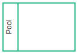

## Subprocesses

Call Activities are handled as tasks, i.e., we assume they terminate after a certain amount of time.

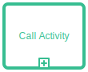
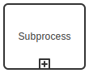
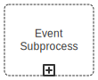
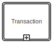

## Tasks

All tasks are handled identically expect Send/Receive tasks which send/receive messages.

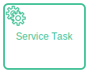
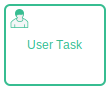


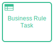
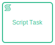
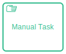
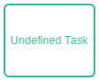
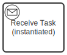

## Gateways


## Markers, Data & Artifacts

Markers, data and artifacts are ignored.

## Events

<table>
  <thead>
      <tr>
        <th>Type</th>
        <th colspan="3">Start</th>
        <th colspan="4">Intermediate</th>
        <th>End</th>
      </tr>
      <tr>
        <th></th>
        <th>Normal</th>
        <th>Event Subprocess</th>
        <th>Event Subprocess non-interrupting</th>
        <th>Catch</th>
        <th>Boundary</th>
        <th>Boundary non-interrupting</th>
        <th>Throw</th>
        <th></th>
      </tr>
  </thead>
  <tbody>
    <tr>
        <td>
            None
        </td>
        <td>
            
        </td>
        <td></td>
        <td></td>
        <td></td>
        <td></td>
        <td></td>
        <td>
            
        </td>
        <td>
            
        </td>
    </tr>
    <tr>
        <td>
            Message
        </td>
        <td>
            
        </td>
        <td>
            
        </td>
        <td>
            
        </td>
        <td>
            
        </td>
        <td>
            
        </td>
        <td>
            
        </td>
        <td>
            
        </td>
        <td>
            
        </td>
    </tr>
    <tr>
        <td>
            Timer
        </td>
        <td>
            
        </td>
        <td>
            
        </td>
        <td>
            
        </td>
        <td>
            
        </td>
        <td>
            
        </td>
        <td>
            
        </td>
        <td></td>
        <td></td>
    </tr>
    <tr>
        <td>
            Error
        </td>
        <td></td>
        <td>
            
        </td>
        <td></td>
        <td></td>
        <td>
            
        </td>
        <td></td>
        <td></td>
        <td>
            
        </td>
    </tr>
    <tr>
        <td>
            Signal
        </td>
        <td>
            
        </td>
        <td>
            
        </td>
        <td>
            
        </td>
        <td>
            
        </td>
        <td>
            
        </td>
        <td>
            
        </td>
        <td>
            
        </td>
        <td>
            
        </td>
    </tr>
    <tr>
        <td>
            Conditional
        </td>
        <td>
            
        </td>
        <td>
            
        </td>
        <td>
            
        </td>
        <td>
            
        </td>
        <td>
            
        </td>
        <td>
            
        </td>
        <td></td>
        <td></td>
    </tr>
    <tr>
        <td>
            Escalation
        </td>
        <td></td>
        <td>
            
        </td>
        <td>
            
        </td>
        <td></td>
        <td>
            
        </td>
        <td>
            
        </td>
        <td>
            
        </td>
        <td>
            
        </td>
    </tr>
    <tr>
        <td>
            Compensation
        </td>
        <td></td>
        <td>
            
        </td>
        <td></td>
        <td></td>
        <td>
            
        </td>
        <td></td>
        <td>
            
        </td>
        <td>
            
        </td>
    </tr>
    <tr>
        <td>
            Cancel
        </td>
        <td></td>
        <td></td>
        <td></td>
        <td></td>
        <td>
            
        </td>
        <td></td>
        <td></td>
        <td>
            
        </td>
    </tr>
    <tr>
        <td>
            Terminate
        </td>
        <td></td>
        <td></td>
        <td></td>
        <td></td>
        <td></td>
        <td></td>
        <td></td>
        <td>
            
        </td>
    </tr>
    <tr>
        <td>
            Link
        </td>
        <td></td>
        <td></td>
        <td></td>
        <td>
            
        </td>
        <td></td>
        <td></td>
        <td>
            
        </td>
        <td></td>
    </tr>
    <tr>
        <td>
            Multiple
        </td>
        <td>
            
        </td>
        <td>
            
        </td>
        <td>
            
        </td>
        <td>
            
        </td>
        <td>
            
        </td>
        <td>
            
        </td>
        <td>
            
        </td>
        <td>
            
        </td>
    </tr>
    <tr>
        <td>
            Multiple Parallel
        </td>
        <td>
            
        </td>
        <td>
            
        </td>
        <td>
            
        </td>
        <td>
            
        </td>
        <td>
            
        </td>
        <td>
            
        </td>
        <td></td>
        <td></td>
    </tr>

  </tbody>
</table>